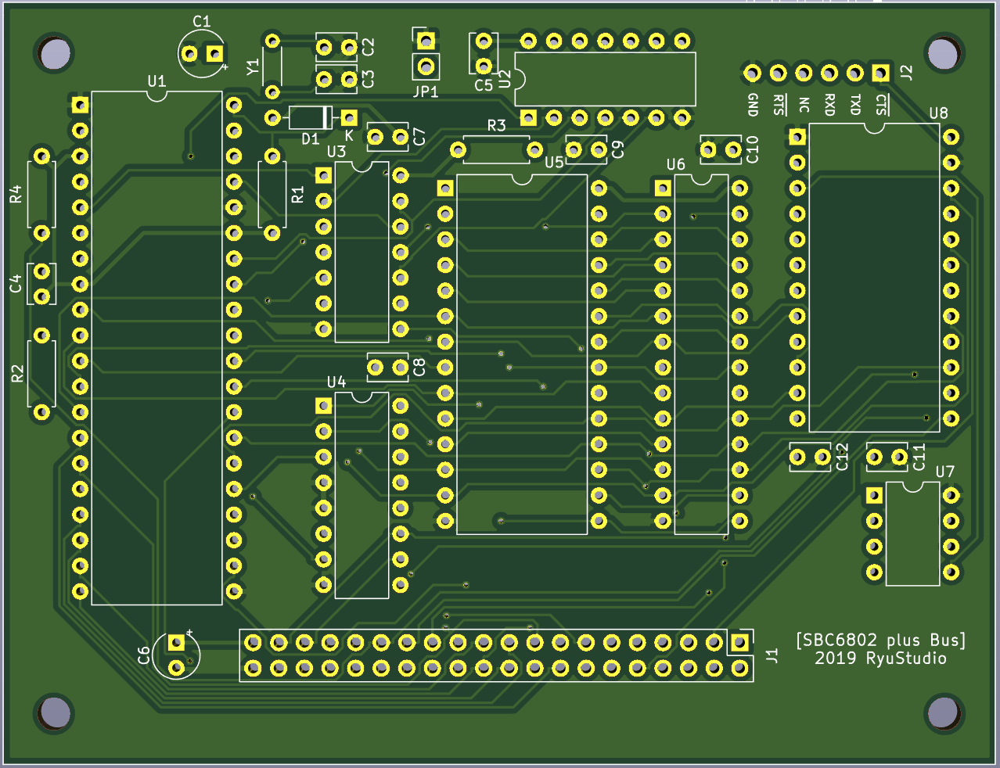

# SBC6802 plus Bus

Ja | [En](README.md)
Rev. 1.0

モトローラ 6802 を使用したシングルボードコンピュータです。電脳伝説様設計 SBC68 シリーズからの派生です。レトロな雰囲気様設計 SBC-Bus 2.0 対応のバスコネクタを装備しており、電源供給も SBC-Bus に依存します。

* MPU6802（内蔵 RAM は無効化）
* RAM 32KB（0x0000 - 0x7fff）
* ROM 16KB (0xc000 - 0xffff x ２ バンク、ジャンパ JP1 で選択)
* ACIA（0x8018/0x8019）

現在製作・テスト中のコンピュータですので本リポジトリには不完全な情報が多々含まれると思います。内容は随時追加・変更する予定です。

## 主なファイル

* [回路図](sbc6802_sch.pdf)
* [Gerber](sbc6802_gerber_osh.zip)
* [部品表](sbc6802_BOM.pdf)

## 参考リンク

* [SBC6800](https://www.switch-science.com/catalog/3581/)
* [SBC6809](https://www.switch-science.com/catalog/3583/)
* [SBC-Bus 2.0](https://store.shopping.yahoo.co.jp/orangepicoshop/pico-a-008.html)
* [as0 Motorola 6800 Assembler](https://github.com/JimInCA/motorola-6800-assembler)
* [M6800 Assembly VSCode Extension](https://marketplace.visualstudio.com/items?itemName=RyuStudio.m6800-as0)

SBC6802 のメモリと ACIA アドレスは SBC6800 互換なので、SBC6800 データパックに含まれる Mikbug が実行可能です。未検証ですが、データパック内のその他のソフトウェアも実行可能だと思います。
