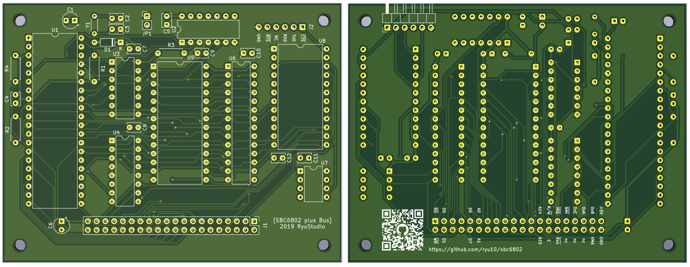

# SBC6802 plus Bus

Ja | [En](README.md)

Rev. 1.0

モトローラ 6802 を使用したシングルボードコンピュータです。SBC6800/SBC6809（@vintagechips 様設計）からの派生です。SBC-Bus 2.0（@tomi9tw 様設計）対応のコネクタを装備しています。

現在製作テスト中のコンピュータですので、本リポジトリには不完全な情報が多々含まれると思います。内容は随時追加修正する予定です。

## 搭載機能

本ボードの機能は以下の通りです。

* MPU MC6802 1MHz（内蔵 RAM 無効）
* RAM 32KB（0x0000 - 0x7fff）
* ROM 16KB (0xc000 - 0xffff x ２ バンク、ジャンパ JP1 で選択)
* ACIA（0x8018/0x8019）
* SBC-Bus 2.0 コネクタ

## 主なファイル

リポジトリに含まれる主要なファイルは次の通りです。

* [回路図](sbc6802_sch.pdf)
* [Gerber](sbc6802_gerber_osh.zip)
* [部品表](sbc6802_BOM.pdf)

これ以外に、KiCAD プロジェクトがリポジトリに入っています。

## SBC-Bus

SBC-Bus 2.0 の標準ピンアサインから 1 か所だけ変更があります。

* Pin 38: VMA（標準アサインは NC）

ご利用の SBC-Bus システムのアサインと競合する場合はパターンカットしてください。

SBC6802 plus Bus ボードの電源供給とリセットボタンは SBC-Bus からのものを利用します。SBC-Bus へ接続しない場合は、ボード下部のコネクタ端子から +5V、GND、Res*（リセット）などを取り出して配線してください。端子名はボード裏面のシルクに印刷されています。

## SBC6800 用ソフトウェアの使用

BC6802 plus Bus のメモリおよび ACIA アドレスは SBC6800 互換です。[SBC6800 データパック](http://www.amy.hi-ho.ne.jp/officetetsu/storage/sbc6800_datapack.zip)に含まれる Mikbug.hex をそのまま ROM に書き込めば動作します。未検証ですが、データパック内の他のソフトウェアもほぼすべて使用可能だと思います。

## 参考リンク

* [SBC6800](https://www.switch-science.com/catalog/3581/)
* [SBC6809](https://www.switch-science.com/catalog/3583/)
* [SBC-Bus 2.0](https://store.shopping.yahoo.co.jp/orangepicoshop/pico-a-008.html)
* [as0 Motorola 6800 Assembler](https://github.com/JimInCA/motorola-6800-assembler)
* [M6800 Assembly VSCode Extension](https://marketplace.visualstudio.com/items?itemName=RyuStudio.m6800-as0)

